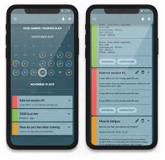

# Sport App
### Application for coaching athletes

## General Info

Application to create training and nutrition plans. You can invite your athletes and send them plans. Analysis of data collected from training.  
  
This **rails JSON API** is meant to serve this [angular 7 SPA client](https://github.com/michalgrzegor/sport-app).  
  
Link to app: [app](https://serene-kare-990ab9.netlify.app/)
  
Credentials for test account:
- email: **testsportapptest@gmail.com**
- password: **TestApp1!**

## Technologies

- ruby 2.5.1
- rails 5.2.1
- postgresql
- auth0
- stripe
